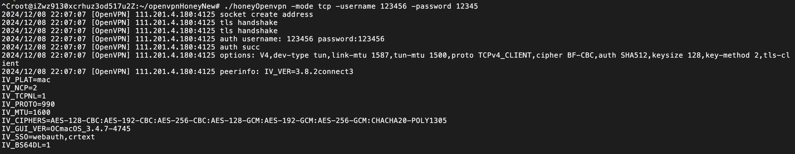

# HoneyOpenVPN
# `honeyOpenvpn-dev` 使用说明

## 参数列表

| 参数        | 类型    | 默认值         | 说明                          |
|-------------|---------|----------------|-------------------------------|
| `-ca`       | `string` | `"ca.crt"`     | CA 证书文件路径               |
| `-cert`     | `string` | `"server.crt"` | 服务器证书文件路径            |
| `-key`      | `string` | `"server.key"` | 服务器私钥文件路径            |
| `-mode`     | `string` | `"udp"`        | 服务器模式：`tcp` 或 `udp`    |
| `-password` | `string` | 无默认值       | 客户端认证密码                |
| `-port`     | `int`    | `1194`         | 服务器端口号                  |
| `-tlsport`  | `int`    | `1195`         | TLS 通信端口号                |
| `-username` | `string` | 无默认值       | 客户端认证用户名              |

---

## 使用示例

### 启动 UDP 模式的服务器
```bash
./honeyOpenvpn -mode udp -port 1194 -ca ca.crt -cert server.crt -key server.key -username 123 -password 123
```
若不使用账号密码，默认所有账户可以通过验证

### 测试结果

